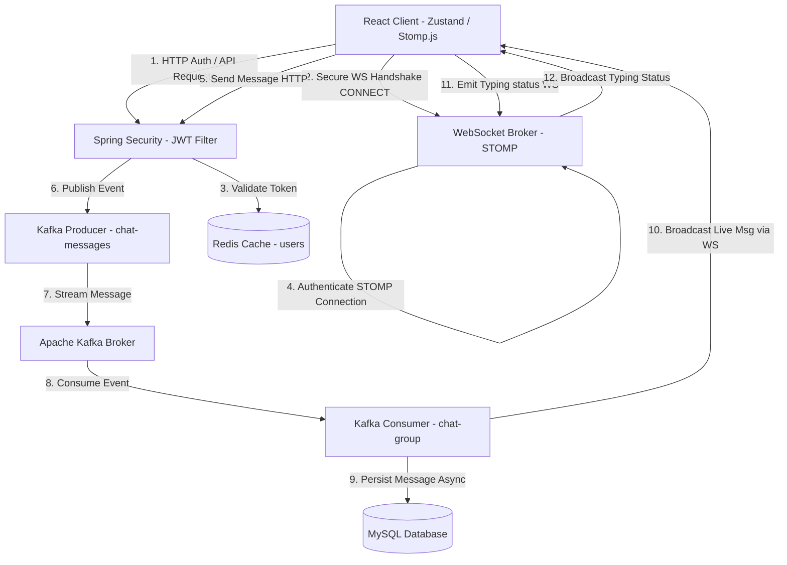

# WhatsApp Web Clone - Real-Time Asynchronous Messaging Engine

A high-performance, secure, and event-driven full-stack WhatsApp Web clone built using **Spring Boot 3 (Java 21)**, **React (Vite)**, **Apache Kafka**, **Redis**, **MySQL**, and **Docker**. 

This project demonstrates production-grade system design patterns, including event-driven message queuing, stateless JWT security, WebSocket session authentication, key-value caching strategies, and Project Loom virtual thread concurrency.

---

## 🏗️ System Architecture

The following diagram illustrates the decoupled, event-driven data flow and authentication checks:



---

## ⚡ Key Architectural Highlights

* **Token-Authorized WebSocket Handshakes**: Connection requests to the STOMP message broker (`/ws-chat`) are intercepted by a custom `ChannelInterceptor`. The bearer token is extracted and validated, binding the authenticated principal securely to the WebSocket session.
* **Event-Driven Messaging (Apache Kafka)**: Immediate API message requests are written to the `chat-messages` Kafka topic partition (using the sender's ID as the partition key to guarantee chronological message delivery). A consumer service processes these events asynchronously to write them to MySQL, decoupling database overhead from active socket transmissions.
* **Granular Key-Value Caching (Redis)**: Individual user profile records are cached using `@Cacheable` keyed on their unique `publicId`. Updates trigger an O(1) `@CacheEvict`, eliminating global list invalidation anti-patterns.
* **Virtual Threads (Project Loom)**: Enabled Spring Boot 3 virtual threads to efficiently handle blocking JDBC database queries and prevent tomcat servlet execution pool starvation under heavy loads.
* **Centralized Exception Handling & Input Validation**: REST boundaries enforce JSR-380 input rules (`@NotBlank`, `@Size`, `@Email`) while custom validation failures are structured and returned to clients via a global `@RestControllerAdvice` handler, hiding internal stack traces.
* **Optimized React Store & Sockets**: Zustand handles reactive UI states. Real-time typing indicators are decoupled from connection lifecycles; changing chats unsubscribes from the old STOMP indicator topic and binds to the new one dynamically without socket reconnection overhead.

---

## 🛠️ Tech Stack

### Backend
* **Language & Framework**: Java 21, Spring Boot 3.4.1 (Spring Security, Spring Web, Spring Cache)
* **Databases**: MySQL 8.0 (Data Tier), Redis 7.2 (Cache Tier)
* **Message Broker**: Apache Kafka 3.9.0
* **Tokens & Encryption**: JSON Web Token (JWT), BCrypt Password Hashing

### Frontend
* **Core**: React 18, Vite, Tailwind CSS
* **State Management**: Zustand (Selective persist middleware)
* **Client-Socket communication**: STOMP.js (Over WebSocket wss/ws protocol), Axios (HTTP auth interceptors)

### DevOps
* **Containerization**: Docker, Docker Compose (Multi-stage build pipelines, sequential service orchestration with automated healthchecks)

---

## 🚀 Local Development Setup

### Prerequisites
* [Docker & Docker Compose](https://www.docker.com/products/docker-desktop/) installed.

### Step 1: Clone and Configure Environment Files
1. Create a `.env` file in the **project root directory**:
   ```env
   JWT_SECRET=404E635266556A586E3272357538782F413F4428472B4B6250655368566D5971
   ```

### Step 2: Spin Up Containers
Launch the database, Kafka broker, Redis, backend, and React client concurrently:
```bash
docker compose up --build
```

The container healthchecks will automatically coordinate the startup sequence:
1. `whatsapp-db` (MySQL), `whatsapp-redis` (Redis), and `whatsapp-kafka` (Kafka) will launch first and pass health checks.
2. `whatsapp-backend` (Spring Boot) compiles and packages the jar, starting only when the databases are healthy.
3. `whatsapp-frontend` (React) launches, bound to port `5173`.

Access the application in your browser at: **`http://localhost:5173`**

---

## ☁️ Cloud Deployment Configuration (Aiven/Production)

The application is built to load production endpoints dynamically via environment variables without code modification. Supply these properties in your cloud container orchestrator (e.g., Render, Koyeb, AWS ECS):

### Backend Environment Variables
* **`JWT_SECRET`**: Production JWT signature hex key.
* **`CORS_ORIGIN`**: Your deployed frontend URL (e.g., `https://your-app.vercel.app`).
* **`DB_URL`**: Aiven MySQL string: `jdbc:mysql://<HOST>:<PORT>/<DB_NAME>?useSSL=true&requireSSL=true`
* **`DB_USER`** / **`DB_PASSWORD`**: Aiven MySQL credentials.
* **`REDIS_HOST`** / **`REDIS_PORT`** / **`REDIS_PASSWORD`**: Aiven Redis coordinates.
* **`REDIS_SSL_ENABLED`**: Set to `true` (Aiven Redis enforces TLS).
* **`KAFKA_BOOTSTRAP_SERVERS`**: Aiven Kafka broker URL (e.g., `kafka-xxx.aivencloud.com:12345`).
* **`KAFKA_SECURITY_PROTOCOL`**: Set to `SASL_SSL`.
* **`KAFKA_SASL_MECHANISM`**: Set to `SCRAM-SHA-256`.
* **`KAFKA_USERNAME`** / **`KAFKA_PASSWORD`**: Aiven Kafka credentials.

### Frontend Environment Variables
Set these variables before building your Vite production bundle:
* **`VITE_API_BASE_URL`**: `https://<your-backend-domain>/api`
* **`VITE_WS_URL`**: `wss://<your-backend-domain>/ws-chat`

---

## 📁 Repository Structure

```
├── backend/
│   ├── src/main/java/com/naveenmandal/backend/
│   │   ├── chat/           # Chat room controllers, entities, services
│   │   ├── config/         # Security configs, WebSockets interceptors, Redis JSON serializing
│   │   ├── exception/      # RestControllerAdvice handlers
│   │   ├── message/        # Kafka consumer/producer pipelines, message database mapping
│   │   ├── security/       # JWT token filters, custom UserDetailsService
│   │   └── user/           # User schema and Redis caching logic
│   ├── Dockerfile
│   └── pom.xml
├── frontend/
│   ├── src/
│   │   ├── api/            # Axios instance and JWT request interceptors
│   │   ├── components/     # UI layouts (Sidebar, Chat window, Contact lists)
│   │   ├── hooks/          # useWebSocket custom subscriptions
│   │   └── store/          # Zustand global states
│   ├── Dockerfile
│   └── package.json
├── docker-compose.yml
├── .gitignore
└── README.md
```
